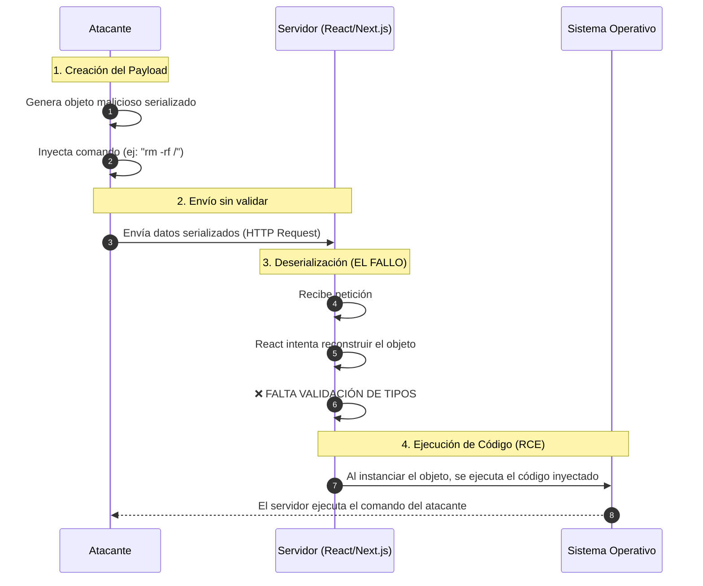

# Análisis de Vulnerabilidad en React (Diciembre 2025)

## 1. Identificación del Párrafo Técnico

El párrafo que contiene la explicación técnica detallada de cómo se logra la ejecución remota de código es el **Párrafo 5**.

> "Dentro de los detalles técnicos, se menciona que React Server Components utiliza un mecanismo de serialización y deserialización para transmitir estados entre cliente y servidor. Cuando este proceso no valida adecuadamente los datos recibidos, un atacante puede inyectar estructuras manipuladas que, al ser interpretadas por el servidor, terminan ejecutando instrucciones arbitrarias..."

## 2. Explicación de la Causa Técnica (Vulnerabilidad CVSS 10.0)

**Causa Principal: Deserialización Insegura**

La vulnerabilidad se origina en la forma en que React Server Components maneja la comunicación de datos. Para mover información compleja entre el servidor y el navegador del usuario, React convierte estos datos en un formato transmisible (serialización) y luego los reconstruye en el otro extremo (deserialización).

El problema técnico es que el servidor **confía ciegamente en la estructura de los datos que recibe para ser deserializados**. Al no existir una validación estricta antes de procesar estos paquetes de datos:

1.  Un atacante puede crear un objeto de datos malicioso (con instrucciones ocultas en su estructura) en lugar de datos legítimos.
2.  Envía este objeto al servidor aparentando ser una comunicación normal de React.
3.  El servidor, al intentar "leer" (deserializar) este objeto para usarlo, termina ejecutando el código malicioso incrustado dentro de él.

Es como recibir un paquete por correo que dice contener un libro, pero al abrirlo activa un mecanismo robótico; si no pasas el paquete por un escáner de seguridad antes de abrirlo, el mecanismo se activa dentro de tu casa. En este caso, el servidor "abre" el paquete de datos y ejecuta el código del atacante automáticamente.

## 3. Representación Gráfica del Ataque

El siguiente diagrama ilustra el flujo de la vulnerabilidad de de serialización insegura en React Server Components:



### Explicación Visual Simplificada

```text
[ ATACANTE ] 
      |
      |  (1) Envía "Caja de Regalo" (Datos Serializados)
      |      que contiene una "Bomba" (Código Malicioso)
      v
[ SERVIDOR ]
      |
      |  (2) Recibe la caja.
      |      CONFÍA en el remitente.
      |
      +---> (3) Abre la caja (Deserialización)
               SIN revisar el contenido antes.
               
               ¡BOOM! 💥
               (4) El código malicioso se ejecuta
                   apenas se reconstruye el objeto.
```